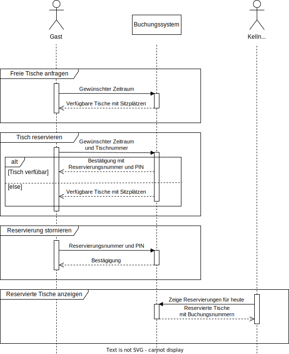
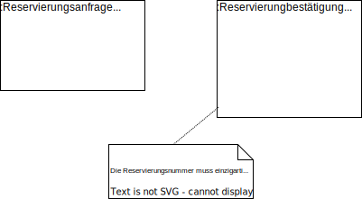
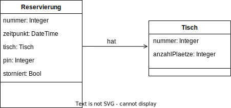
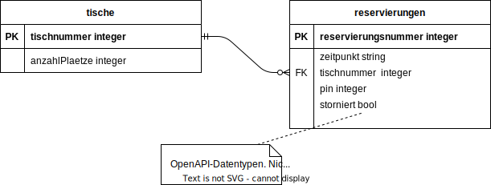
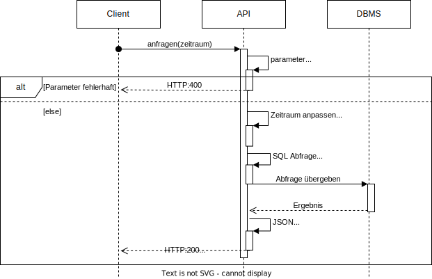

# Tischreservierung
Ein Beispiel für die Entwicklung einer API mit Flask.

Flask ist ein Python Framework für das Backend, das HTTP-Requests zu Python-Funktionen zuordnet.

## Warum Flask?
Eine Erläuterung inkl. Nutzwertanalyse findet sich [hier](diagramme/Nutzwertanalyse.md).

## Wie man mit diesem Repository arbeitet
Dieses Repository enthält Branches, die unterschiedliche Versionen des gleichen Beispiels enthalten. Einige Beispiele: 
- Der [main-branch](https://github.com/gsoTH/tischreservierung/tree/main) enthält das Lastenheft und Anforderungen des Kunden
- Der [nurSQL-branch](https://github.com/gsoTH/tischreservierung/tree/nurSQL) entält eine Implementierung ohne den Einsatz von Objekt-Rationalen-Mappern, also pures SQL - eine Variante die **nur** für Lehrzwecke geeignet ist.

## Wie kann ich mir eine Lösung ansehen?
Der gesamte Code kann direkt im Browser eingesehen werden. In diesem Branch ist die gesamte api in der Datei [api/api.py](api/api.py) untergebracht. 

Um das Projekt lokal auszuführen kann nach einem Download und der Installation der pip-Pakete unter requirements.txt ein lokaler Server gestartet werden (d.h. das Python-Skript starten). Mit dem Browser können dann Anfragen gestellt werden, es gibt aber auch Tools zum API-Test, wie z.B. Postman.

# Anforderungen

## Auszug aus dem Lastenheft
Ein Restaurant möchte ein Buchungssystem für die Reservierung von Tischen einführen. Das Restaurant hat eine Filiale mit weniger als 20 Tischen. 

### Beschreibung des Ist-Zustands
Derzeit werden Reservierungen via Telefon geregelt. Kunden rufen an und geben einen gewünschten Zeitpunkt und ggf. eine Personenzahl an. Der Kellner überprüft, welche Tische für den jeweiligen Zeitpunkt in Frage kommen. Falls genügend Tische zur Verfügung stehen, wird die Reservierung mit den betroffenen Tischnummern und einem Namen, ggf. mit einer Telefnonummer in einen großen Terminplan eingetragen. 

Es hat sich als praktikabel gezeigt, dass eine Reservierung nur zur halben Stunde (z.B. 16:30 Uhr, 17:30 Uhr) angeboten werden und jeweils für eine Stunde gelten.

In einigen Fällen kommt es vor, dass Reservierungen telefonisch wieder storniert werden. 

### Beschreibung des Soll-Konzepts
Die Reservierung soll zukünftig nur noch über ein Buchungssystem erfolgen. Die Kunden sollen über unsere Webseite die freien Tische zu einem gewünschten Termin anzeigen können. Anschließend sollen sie die Tische reservieren und die Reservierung ggf. stornieren können. 

Vor Ort benötigen die Kellner nur Einblick über alle Reservierungen des aktuellen Tages, um Gäste zu ihren Tischen zu leiten.

Personenbezogene Daten sollen vorerst nicht erhoben werden.

Das System soll zukünftig erweiterbar sein, um z.B. mehrere Filialen einbinden zu können.

## Fachkonzept
Ausgehend von der Situationsbeschreibung wurde die Situation vertieft analysiert. Ergebnis waren mehrere UML-Diagramme.

### Anwendungsfalldiagramm
Das nachfolgende UML-Use-Case Diagramm zeigt die Anwendungsfälle, die das neue System zur Verfügung stellen soll.

### Sequenzdiagramm
Daraus wurde dieses UML-Sequence Diagramm entwickelt, das die Abläufe der UseCases genauer darstellt. 

**Nachrichtenbezeichnungen anpassen, damit ein Mapping zum Objektdiagramm möglich ist?**

### Objektdiagramme
Aus dem Sequenzdiagramm lassen sich einzelne Nachrichten ableiten.Beispiele für die Inhalte der gesendeten Informationsobjekte stelle ich als UML-Object Diagramm dar. 

#### Freie Tische anfragen

#### Tisch reservieren

#### Reservierung stornieren

____
## Planung der Implementierung
### Klassendiagramm
Dieses UML-Class Diagramm versucht die Informationen aller Objekte in möglichst wenigen Klassen darzustellen. 

### ERD
Auf Basis des Klassendiagramms wurde ein Entity-Relationship-Diagramm erstellt, das geeignet ist, alle notwendigen Informationen in einer Relationalen Datenbank abzulegen. 

Für Testzwecke wurde dieses ERD in einer [SQLite Datenbank](create_buchungssystem.sql) realisiert. In späteren Phasen der Entwicklung sollte ein mehrbenutzerfähiges DBMS genutzt werden.

### Detailplanung der Anwendungsfälle
Beispielhaft wird für den ersten Anwendungsfall ein detailliertes Sequenzdiagramm darsgestellt.

### OpenApi Spezifikation
Inspiriert von einer [Api-Dokumentation mit Katzen](https://catfact.ninja/) wurde eine [OpenApi Spezifikation](https://swagger.io/specification/) mit dem [SwaggerEditor](https://editor.swagger.io/) erzeugt.
 __Ob es sinnvoll ist, diese Dokumentation vor einer Detailplanung der Anwendungsfälle zu erzeugen ist fragwürdig. (Das bedeutet, es ist nicht sinnvoll ;) )__

Die [JSON-Datei](api/openapi.json) dokumentiert die (geplanten) API-Funktionen. Wenn die Datei in den  [SwaggerEditor](https://editor.swagger.io/) importiert wird, kann man eine schön formatierte Übersicht erhalten.  Anschließend wurden die zugehörigen API-Endpunkte im Python-Skript erzeugt.

__Swagger wurde nicht imporiert, um dieses Projekt nicht zu erschlagend werden zu lassen.__

## Implementierung
In diesem Branch ist die gesamte api in der Datei [api/api.py](api/api.py) untergebracht. 
Die notwendigen Pakete stehen in den import-Anweisungen oder der requirements.txt. Installation ggf. via pip.

## :rocket: Offene Punkte / Einstiegspunkte für die Weiterentwicklung 
- Der Code versößt gegen Clean-Code Vorgaben, wie z.B. DRY (Don't repeat yourself). Welche Verbesserungen könnte man mit einem Refactoring erreichen?
- Der vierte UseCase (Kellner möchte Reservierungen sehen), wurde wegen Sicherheitsbedenken nicht implementiert. Welche könnten das sein? Haben Sie einen Lösungsvorschlag?

## Anhang
### Log / Fragen / Lessons Learned
- Die Idee der Stornierungspin kam mir erst bei der Modellierung der Objektdiagramme. Anschließend habe ich das Sequenzdiagramm aktualisiert. Schließlich habe ich den Eindruck, dass im Sequenzdiagramm nur die Titel der Objekte auf den Pfeilen dargestellt werden sollten.
- ~~Die Motivation für Klassendiagramme ist nicht klar. Mir fällt es leichter, ein ERD zu entwickeln.~~ Das Denken in Klassen macht sich bei der Spezifikation der API nützlich: Dort kann man sich Arbeit sparen, wenn eine Klasse für die JSONs modelliert wurde. Beim Einsatz von ORM werden Klassen eine größere Rolle spielen.
- Die Spalten datum und UhrzeitVon lassen sich in SQLite in einer einzigen Spalte abbilden. Ich bin mir nicht sicher, ab welchem Zeitpunkt ich auf einzelne Technologien eingehen soll. Spätestens ab der Detailplanung der Anwendungsfälle werde ich auch Technologien eingehen müssen.
- LessonLearned: Typisierung tut Not! Ich habe einige Zeit mit dem POST eines JSONs verbraten, weil z.B. `r = request.json.get("reservierungsnummer")` eine automatische Typisierung vornimmt (`r` wird integer, aber ich habe einen string benötigt).

### Tools
- [Postman kann genutzt werden, um APIs zu testen](https://www.postman.com/)
- [SwaggerEditor kann genutzt werden um OpenAPI Dokumentation zu erzeugen/anzuzeigen](https://editor.swagger.io/)

### Quellen
- [OpenApi Felddefinitionen](https://swagger.io/specification/)
- [Beispiel Api-Dokumentation mit Katzen](https://catfact.ninja/) Beispiel für den Aufruf mit Parameter: https://catfact.ninja/fact?max_length=40
- [Beispiel für das Internet-Zeitformat](https://xml2rfc.tools.ietf.org/public/rfc/html/rfc3339.html#anchor14)
- [Liste der HTTP-Status Codes auf Wikipedia](https://en.wikipedia.org/wiki/List_of_HTTP_status_codes)
